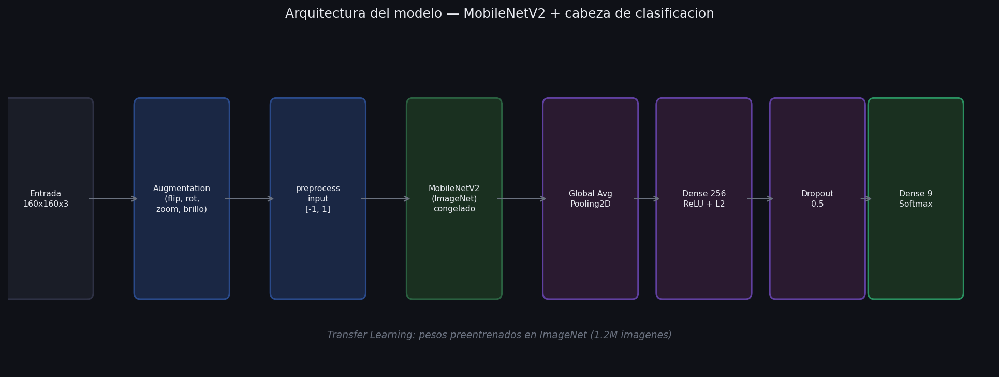
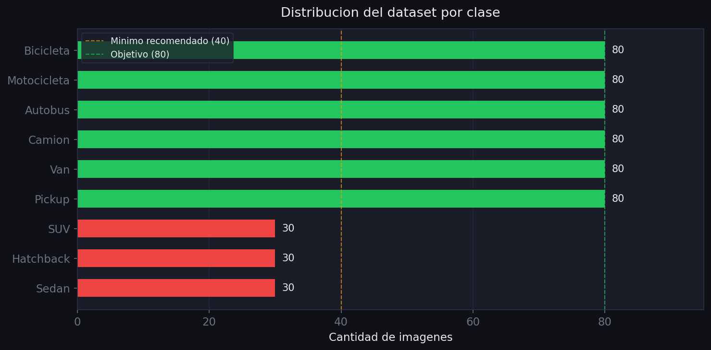
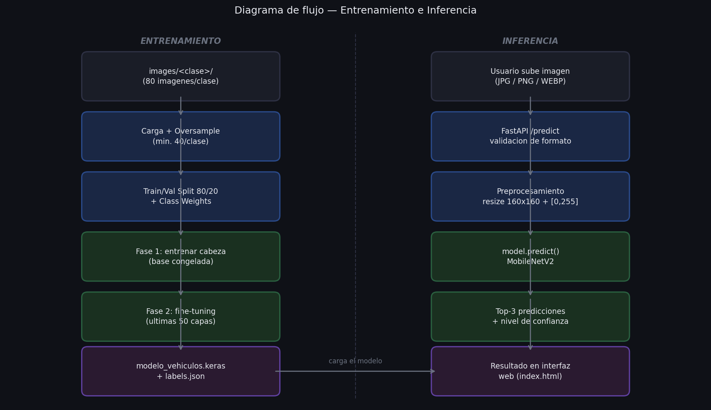
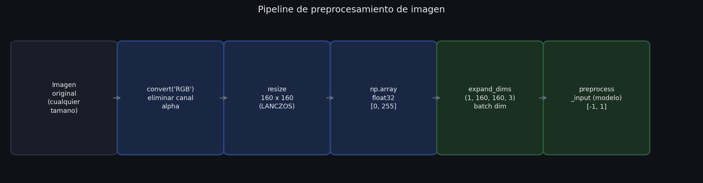
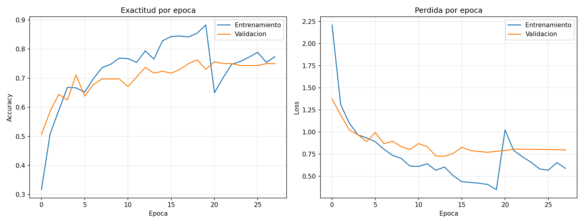

\newpage

# 1. Descripcion del Proyecto

Este proyecto es una aplicacion web que permite al usuario subir una foto de cualquier vehiculo y obtener de forma automatica su clasificacion junto con un porcentaje de certeza. El sistema identifica nueve tipos de vehiculos: sedan, hatchback, SUV, pickup, van, camion, autobus, motocicleta y bicicleta.

La interfaz es completamente visual, no requiere conocimientos tecnicos y responde en menos de dos segundos. El usuario simplemente arrastra o selecciona una imagen, presiona el boton de clasificar, y el sistema muestra el tipo detectado, la probabilidad principal y las tres opciones mas probables.

Tecnicamente el proyecto combina una red neuronal convolucional entrenada con Keras, un servidor de API construido con FastAPI, y una interfaz web en HTML y JavaScript puro, todo corriendo en local sin necesidad de servicios externos.

---

# 2. Tecnologias Utilizadas

| Componente | Tecnologia | Rol |
|---|---|---|
| Modelo de IA | Keras + TensorFlow | Clasificacion de imagenes |
| Base del modelo | MobileNetV2 (ImageNet) | Transfer learning |
| API | FastAPI | Servidor de prediccion |
| Interfaz | HTML + CSS + JavaScript | Interaccion con el usuario |
| Dataset | Imagenes propias + MIO-TCD | Entrenamiento |

---

# 3. Arquitectura del Modelo

El modelo utiliza **transfer learning** con MobileNetV2, una red neuronal convolucional preentrenada en el dataset ImageNet, que contiene mas de 1.2 millones de imagenes de 1000 categorias distintas. Esto permite que el modelo ya conozca como detectar bordes, texturas y formas generales antes de ser ajustado para reconocer vehiculos especificamente.

El proceso de entrenamiento se divide en dos fases:

**Fase 1 — Entrenamiento de la cabeza:** La base de MobileNetV2 permanece congelada (sus pesos no cambian). Solo se entrenan las capas nuevas agregadas encima: una capa densa de 256 neuronas con regularizacion L2, una capa de Dropout al 50% para evitar sobreajuste, y la capa de salida con 9 neuronas (una por clase).

**Fase 2 — Fine-tuning:** Se descongelan las ultimas 50 capas de MobileNetV2 y se continua el entrenamiento con una tasa de aprendizaje muy baja. Esto permite que el modelo ajuste sus representaciones internas para las caracteristicas particulares de los vehiculos.

---

# 4. Dataset

El dataset de entrenamiento combina dos fuentes:

1. **Imagenes propias:** descargadas especificamente para cada categoria mediante busqueda por tipo de vehiculo. Garantizan buena representacion de cada clase pero en cantidad limitada.

2. **Dataset MIO-TCD:** dataset publico de clasificacion de transito con miles de imagenes reales capturadas en carretera. Se tomaron hasta 80 imagenes adicionales por clase para completar las categorias con menos datos.

La siguiente figura muestra la distribucion final del dataset despues de la fusion de ambas fuentes:

Las clases sedan, hatchback y SUV mantienen 30 imagenes cada una ya que no existe una fuente etiquetada equivalente en MIO-TCD. El sistema aplica **oversample** para completar estas clases hasta el minimo de 40 muestras, generando copias con pequenas variaciones de brillo y volteo horizontal.

Adicionalmente, durante el entrenamiento se aplica **data augmentation** en cada batch: rotaciones aleatorias, zoom, desplazamientos, cambios de brillo y contraste. Esto multiplica efectivamente la variedad del dataset sin agregar imagenes reales.

---

# 5. Diagrama de Flujo del Sistema

El sistema opera en dos modos distintos: entrenamiento (offline, ejecutado una sola vez) e inferencia (en tiempo real, cada vez que el usuario clasifica una imagen).

---

# 6. Pipeline de Preprocesamiento

Cada imagen pasa por una serie de transformaciones antes de ser analizada por el modelo. El objetivo es convertirla al formato exacto que MobileNetV2 espera como entrada.

Los pasos son:

1. **Conversion a RGB:** elimina el canal alpha en PNGs o convierte imagenes en escala de grises.
2. **Redimension a 160x160:** usa interpolacion LANCZOS para minimizar artefactos.
3. **Conversion a array NumPy float32:** valores en rango `[0, 255]`.
4. **Dimension de batch:** agrega una dimension extra para que tenga la forma `(1, 160, 160, 3)`.
5. **preprocess_input:** capa interna del modelo que escala a `[-1, 1]`, rango requerido por MobileNetV2.

Es importante que el preprocesamiento de inferencia (en `main.py`) sea identico al de entrenamiento (en `train_model.py`). Cualquier diferencia causa predicciones incorrectas.

---

# 7. Resultados del Entrenamiento

La siguiente grafica muestra la evolucion de la exactitud y la perdida a lo largo de las epocas de entrenamiento. Se aprecian las dos fases: la primera con convergencia rapida y la segunda con ajuste fino mas gradual.

El modelo alcanza su mejor desempeno en validacion gracias a tres mecanismos de control:

- **ModelCheckpoint:** guarda automaticamente el mejor modelo segun la exactitud de validacion.
- **EarlyStopping:** detiene el entrenamiento si no hay mejora en 8 epocas consecutivas.
- **ReduceLROnPlateau:** reduce la tasa de aprendizaje a la mitad si la perdida de validacion se estanca por 3 epocas.

---

# 8. Funcionamiento de la Interfaz

La interfaz web esta construida en HTML, CSS y JavaScript puro, sin frameworks externos. Se sirve directamente desde FastAPI, lo que significa que el usuario solo necesita abrir `http://localhost:8000` en su navegador.

El flujo de uso es el siguiente:

1. El usuario arrastra una imagen o la selecciona desde su equipo.
2. Se muestra una vista previa completa del vehiculo (sin recortes).
3. Al presionar **Clasificar**, la imagen se envia al servidor via `POST /predict`.
4. El servidor responde con el tipo detectado, el porcentaje de certeza y las tres opciones mas probables.
5. La interfaz anima la barra de progreso y muestra el resultado con el nivel de confianza (Alta, Media o Baja).

La comunicacion entre la interfaz y el servidor usa la API REST de FastAPI. El endpoint `/health` permite verificar si el modelo esta cargado correctamente antes de clasificar.

---

# 9. Limitaciones

**Cantidad de datos:** el mayor limitante del sistema es el tamano del dataset. Con 30 a 80 imagenes por clase, el modelo tiene menor margen para generalizar comparado con sistemas entrenados con miles de ejemplos por categoria.

**Clases visualmente similares:** sedan, hatchback y SUV comparten muchas caracteristicas visuales (misma estructura general de automovil). A 160x160 pixeles, las diferencias sutiles de altura o forma del maletero son dificiles de capturar con certeza.

**Angulo y condiciones de la foto:** el modelo fue entrenado principalmente con fotos laterales o de tres cuartos de vehiculos. Fotos desde arriba, desde atras o con oclusiones importantes pueden reducir la precision.

**Clases poco representadas:** aunque se agregaron imagenes del dataset MIO-TCD, las clases sedan, hatchback y SUV siguen teniendo menos datos que el resto, lo que puede afectar su reconocimiento cuando hay vehiculos similares en la imagen.

---

# 10. Areas de Mejora

**Mas datos:** la mejora mas directa seria agregar 200 o mas imagenes por clase con variedad de angulos, colores y condiciones de iluminacion. Con datasets de esta escala el modelo superaria consistentemente el 90% de exactitud.

**Modelos mas grandes:** EfficientNetB0 o ResNet50 ofrecen mejor capacidad representacional a costa de mayor tiempo de inferencia. Para un sistema en produccion podrian dar mejores resultados.

**Mayor resolucion de entrada:** incrementar la entrada de 160x160 a 224x224 permite capturar mas detalles de la carroceria, aunque aumenta el tiempo de entrenamiento e inferencia.

**Despliegue en la nube:** actualmente el sistema corre unicamente en local. Desplegarlo en un servidor con FastAPI y un modelo optimizado (TFLite o ONNX) lo haria accesible desde cualquier dispositivo.

---

# 11. Conclusiones

El proyecto demuestra que es posible construir un clasificador de vehiculos funcional con recursos limitados usando transfer learning. MobileNetV2 preentrenado en ImageNet aporta una base solida de reconocimiento visual que el fine-tuning adapta a las categorias especificas del proyecto.

La combinacion de data augmentation, oversample y class weights permite compensar parcialmente el desbalance y la escasez de datos, haciendo que clases con pocos ejemplos (como autobus o camion) sean reconocibles a pesar de tener menos imagenes de entrenamiento.

El resultado es un sistema completo de extremo a extremo: desde el entrenamiento del modelo hasta la interfaz web de uso inmediato, sin dependencias externas ni configuracion compleja.
